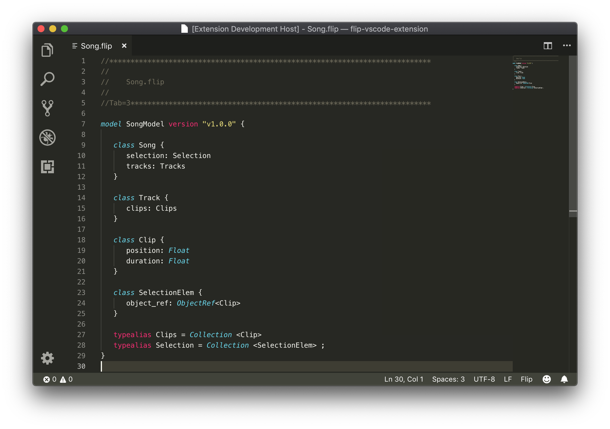

# flip-lang-vscode

A Visual Studio Code extension for Flip language.

Flip is a data model library, designed as a framework, real-time collaboration-oriented, transactional, portable and compact. For more informations, please visit [irisate.com](https://irisate.com/).

## Features

- Provides syntax highlighting of Flip files.
